[home](http://tiny.cc/fss2016) | [copyright](https://github.com/txt/fss16/blob/master/LICENSE.md) &copy;2016, tim&commat;menzies.us<br>
[](http://tiny.cc/fss2016)   <br>
[overview](https://github.com/txt/fss16/blob/master/doc/overview.md) |
[syllabus](https://github.com/txt/fss16/blob/master/doc/syllabus.md) |
[src](https://github.com/txt/fss16/blob/master/src) |
[submit](http://tiny.cc/fss2016give) |
[chat](https://fss16.slack.com/) 

_______

# Feature and Instance Selection

-   Occam's Razor - The English philosopher, William of
    Occam (1300-1349) propounded Occam's Razor:
    -   Entia non sunt multiplicanda praeter necessitatem.
    -   (Latin for "Entities should not be multiplied more
        than necessary"). That is, the fewer assumptions an explanation
        of a phenomenon depends on, the better it is.
-   (BTW, Occam's razor did not survive into the 21st century.
    -   The data mining community modified it to the *Minimum
        Description Length* (MDL) principle.
    -   MDL: the best theory is the smallest BOTH is size AND number
        of errors).
-   Many ways to throw away data
    -   feature selection
    -   range selection
    -   instance selection (prototype generation)

## Feature Section

The case for FSS

Repeated result: throwing out features rarely damages a theory

[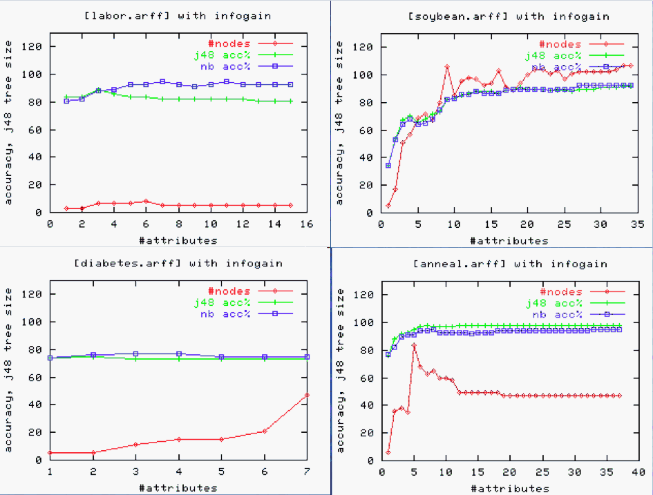](../img/fsses.gif)

And, sometimes, feature removal is very useful:

-   E.g. linear regression on
    [bn.arff](https://github.com/abutcher/toe/blob/master/lisp/data/arff/bn.arff)
    yielded:

        Defects =     
            82.2602 * S1=L,M,VH +
            158.6082 * S1=M,VH +
            249.407  * S1=VH +
             41.0281 * S2=L,H +
             68.9153 * S2=H +
            151.9207 * S3=M,H +
            125.4786 * S3=H +
            257.8698 * S4=H,M,VL +
            108.1679 * S4=VL +
            134.9064 * S5=L,M +
           -385.7142 * S6=H,M,VH +
            115.5933 * S6=VH +
           -178.9595 * S7=H,L,M,VL +
           ...
           [ 50 lines deleted ]

-   On a 10-way cross-validation, this correlates 0.45 from predicted
    to actuals.
-   10 times, take 90% of the date and run a *WRAPPER*- a best first
    search through combinations of attributes. At each step, linear
    regression was called to asses a particular combination
    of attributes. In those ten experiments, WRAPPER found that adding
    feature X to features A,B,C,... improved correlation the following
    number of times:

        number of folds (%)  attribute
                   2( 20 %)     1 S1
                   0(  0 %)     2 S2
                   2( 20 %)     3 S3
                   1( 10 %)     4 S4
                   0(  0 %)     5 S5
                   1( 10 %)     6 S6
                   6( 60 %)     7 S7     <==
                   1( 10 %)     8 F1
                   1( 10 %)     9 F2
                   2( 20 %)    10 F3
                   2( 20 %)    11 D1
                   0(  0 %)    12 D2
                   5( 50 %)    13 D3     <==
                   0(  0 %)    14 D4
                   0(  0 %)    15 T1
                   1( 10 %)    16 T2
                   1( 10 %)    17 T3
                   1( 10 %)    18 T4
                   0(  0 %)    19 P1
                   1( 10 %)    20 P2
                   0(  0 %)    21 P3
                   1( 10 %)    22 P4
                   6( 60 %)    23 P5     <==
                   1( 10 %)    24 P6
                   2( 20 %)    25 P7
                   1( 10 %)    26 P8
                   0(  0 %)    27 P9
                   2( 20 %)    28 Hours
                   8( 80 %)    29 KLoC   <==
                   4( 40 %)    30 Language
                   3( 30 %)    32 log(hours)

-   Four variables appeared in the majority of folds. A second run did a
    10-way using just those variables to yield a smaller model
    with (much) larger correlation (98\\%):

        Defects =
            876.3379 * S7=VL +
           -292.9474 * D3=L,M +
            483.6206 * P5=M +
              5.5113 * KLoC +
             95.4278

### Excess attributes

-   Confuse decision tree learners
    -   Too much early splitting of data
    -   Less data available for each sub-tree
-   Too many things correlated to class?
    -   Dump some of them!

### Why FSS?

-   throw away noisy attributes
-   throw away redundant attributes
-   smaller model= better accuracies (often)
-   smaller model= simpler explanation
-   smaller model= less variance
-   smaller model= any downstream processing will thank you

### Problem

-   Exploring all subsets exponential
-   Need heuristic methods to cull search;
    -   e.g. forward/back select
-   Forward select:

    -   start with empty set
    -   grow via hill climbing:
    -   repeat
        -   try adding one thing and if that improves things
        -   try again using the remaining attributes
    -   until no improvement after N additions OR nothing to add
-   Back select

    -   as above but start with all attributes and discard, don't add
-   Usually, we throw away most attributes:

    -   so forward select often better
    -   exception: J48 exploits interactions more than,say, NB.
    -   so, possibly, back select is better when wrapping j48
    -   so, possibly, forward select is as good as it gets for NB

### FSS types:

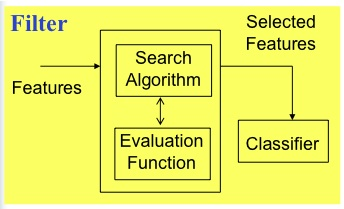    
  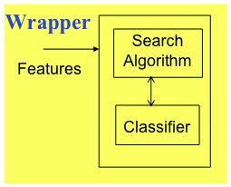

-   filters vs wrappers:

    -   wrappers: use an actual target learners e.g. WRAPPER
    -   filters: study aspects of the data e.g. the rest
    -   filters are faster!
    -   wrappers exploit bias of target learner so often perform better,
        when they terminate
        -   don't terminate on large data sets
-   solo vs combinations:

    -   evaluate solo attributes: e.g. INFO GAIN, RELIEF
    -   evaluate combinations: e.g. PCA, SVD, CFS, CBS, WRAPPER
    -   solos can be faster than combinations
-   supervised vs unsupervised:

    -   use/ignores class values e.g. PCA/SVD is unsupervised, reset
        supervised
-   numeric vs discrete search methods

    -   ranker: for schemes that numerically score attributes e.g.
        RELIEF, INFO GAIN,

    -   best first: for schemes that do heuristic search e.g. CBS, CFS,
        WRAPPER

### Hall and Holmes:

This paper: pre-discretize numerics using entropy.

[Hall & Holmes](http://www.cs.waikato.ac.nz/~mhall/HallHolmesTKDE.pdf)

### INFO GAIN

-   often useful in high-dimensional problems
    -   real simple to calculate
-   attributes scored based on info gain: H(C) - H(C|A)
-   Sort of like doing decision tree learning, just to one level.

### RELIEF

-   [Kononenko97](http://menzies.us/iccle/?refs#Kononenko97)
-   useful attributes differentiate between instances from other class
-   randomly pick some instances (here, 250)
-   find something similar, in an another class
-   compute distance this one to the other one
-   Stochastic sampler: scales to large data sets.
-   Binary RELIEF (two class system) for "n" instances for weights on
    features "F"

        set all weights W[f]=0
        for i = 1 to n; do
           randomly select instance R with class C
           find nearest hit H      // closest thing of same class
           find nearest miss M     // closest thing of difference class
           for f = 1 to #features; do
               W[f] = W[f] - diff(f,R,H)/n + diff(f,R,M)/n
           done
        done

-   diff:
    -   discrete differences: 0 if same 1 if not.
    -   continuous: differences absolute differences
    -   normalized to 0:1
    -   When values are missing, see
        [Kononenko97](http://menzies.us/iccle/?refs#Kononenko97), p4.
-   N-class RELIEF: not 1 near hit/miss, but k nearest misses for each
    class C

        W[f]= W[f] - ∑i=1..k diff(f,R, Hi) / (n*k) 
                   + ∑C ≠ class(R) ∑i=1..k ( 
                                        P(C) / ( 1 - P(class(R)))
                                        * diff(f,R, Mi(C)) / (n*k)
                                       )

    The *P(C) / (1 - P(class(R))* expression is a normalization function
    that

    -   demotes the effect of R from rare classes
    -   and rewards the effect of near hits from common classes.

### CBS (consistency-based evaluation)

-   Seek combinations of attributes that divide data containing a strong
    single class majority.
    -   Kind of like info gain, but emphasis of single winner
-   Discrete attributes
-   Forward select to find subsets of attributes

### WRAPPER

-   Forward select attributes
    -   score each combination using a 5-way cross val
-   When wrapping, best to try different target learners
    -   Check that we aren't over exploiting the learner's bias
    -   e.g. J48 and NB

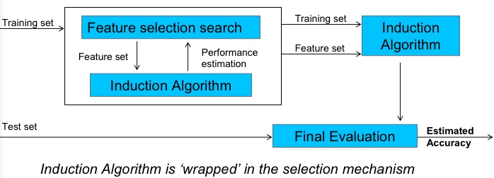

### PRINCIPAL COMPONENTS ANALYSIS (PCA)

(The traditional way to do FSS.)

-   Only unsupervised method studied here
-   Transform dimensions
-   Find covariance matrix C\[i,j\] is the correlation i to j;
    -   C\[i,i\]=1;
    -   C\[i,j\]=C\[j,i\]
-   Find eigenvectors
-   Transform the original space to the eigenvectors
-   Rank them by the variance in their predictions
-   Report the top ranked vectors

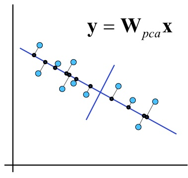

-   Makes things easier, right? Well...

        if   domain1  <= 0.180 
        then NoDefects 
        else if domain1 > 0.180 
             then if domain1 <= 0.371 then NoDefects 
             else if domain1 > 0.371 then Defects 


        domain1 = 0.241 * loc     + 0.236 * v(g) 
                + 0.222 * ev(g)   + 0.236 * iv(g)     + 0.241 *  n 
                + 0.238 * v       - 0.086 * l         + 0.199  * d 
                + 0.216 * i       + 0.225 * e + 0.236 * b + 0.221  * t 
                + 0.241 * lOCode  + 0.179 * lOComment 
                + 0.221 * lOBlank + 0.158 * lOCodeAndComment 
                + 0.163 * uniqO p + 0.234 * uniqOpnd 
                + 0.241 * totalOp + 0.241 * totalOpnd 
                + 0.236 * branchCount

### PCA vs LDA (linear discrminant analysis)

LDA = PCA + class knowledge

(Note: LDA should not be confused with [LDA (latent Dirichlet
allocation)](http://portal.acm.org/citation.cfm?id=944937&dl=GUIDE,)
which currently all the rage in text mining. And that LDA is not covered
in this subject.)

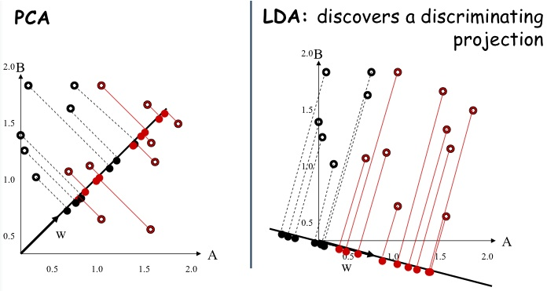

### Latent Semantic Indexing

-   Performing PCA is the equivalent of performing *Singular Value
    Decomposition* (SVD) on the data.

-   Any n \* m matrix X (of terms n in documents m) can be rewritten as:

    -   X = To \* So \* Do'
    -   So is a diagonal matrix scoring attributes, top to bottom, most
        interesting to least interesting
    -   We can shrink X by dumping the duller (lower) rows of So

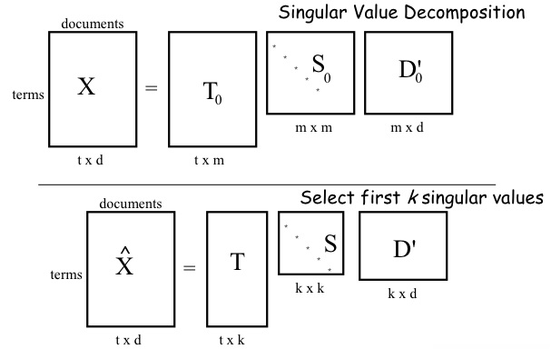

-   Latent Semantic Indexing is a method for selecting informative
    subspaces of feature spaces.
-   It was developed for information retrieval to reveal semantic
    information from document co-occurrences.
-   Terms that did not appear in a document may still associate with
    a document.
-   LSI derives uncorrelated index factors that might be considered
    artificial concepts.

-   SVD easy to perform in Matlab

    -   Also, there is some [C-code](http://menzies.us/iccle/?svd).
    -   Also [Java Classes
        available](http://math.nist.gov/javanumerics/jama/)
        -   class SingularValueDecomposition
            -   Constructor: SingularValueDecomposition(Matrix Arg)
            -   Methods: GetS(); GetU(); GetV(); (U,V correspond to T,D)
-   Be careful about using these tools blindly
    -   It is no harm to understand what is going on!
-   The [Matrix
    Cookbook](http://www.imm.dtu.dk/pubdb/views/edoc_download.php/3274/pdf/imm3274.pdf)

-   Note: major win for SVD/LSI: scales very well.

    -   Research possibility: text mining for software engineering
        -   typically very small corpuses
        -   so might we find better FSS for text mining than SVD/LSI

### CFS (correlation-based feature selection)

-   Scores high subsets with strong correlation to class and weak
    correlation to each other.
-   Numerator: how predictive
-   Denominator: how redundant
-   FIRST ranks correlation of solo attributes
-   THEN heuristic search to explore subsets

### And the winner is:

-   Wrapper! and it that is too slow...
-   CFS, Relief are best all round performers
    -   CFS selects fewer features
-   Phew. Hall invented CFS

### Other Methods

Other methods not explored by Hall and Holmes...

-   Note: the text mining literature has yet to make such an assessment.
    Usually, SVD rules. But see [An Approach to Classify Software
    Maintenance
    Requests](http://www.rcost.unisannio.it/mdipenta/papers/icsm2002class.pdf),
    from ICSM 2002, for a nice comparison of nearest neighbor, CART,
    Bayes classifiers, and some other information retrieval methods).
-   Using random forests for feature selection of the mth variable:

    -   randomly permute all values of the mth variable in the oob data
    -   Put these altered oob x-values down the tree and
        get classifications.
    -   Proceed as though computing a new internal error rate (i.e. run
        the classifier).
    -   The amount by which this new error exceeds the original test set
        error is defined as the importance of the mth variable.
-   Use the Nomogram scores

## Range Selection

From before: use only sharp and relevant ranges.

Using [Nomograms](http://www.saedsayad.com/docs/Nomograms.pdf)

- Martin Možina, Janez Demšar, Michael Kattan, and Blaž Zupan. 2004. 
       Nomograms for visualization of naive Bayesian classifier. In Proceedings of the 
       8th European Conference on Principles and Practice of Knowledge Discovery in Databases (PKDD '04)
- if there are two classes _best_ and _rest_ with `B` and `R` examples
- and `x` occurs  with frequency `n1,n2` in `B,R` 
- then the odds of `x` in _best_ and _rest_ are `b=n1/B` and `r=n2/R`
- then the log of the odds ratio LOR = 0 if `b &le; r` else `log(b/r)`
- and if we normalize LOR to 0,1 min,max
- then we can draw some pretty diagrams and do some simple `what if` queries:

[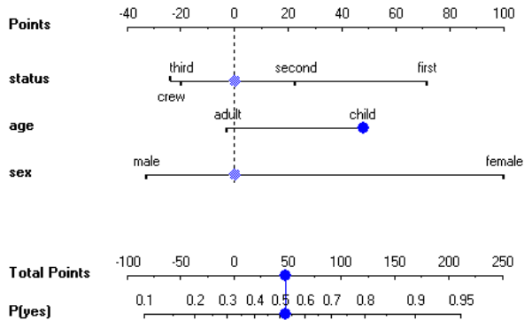](../img/nomo1.png)
  
- The reverse function LOR to  probability with a class occuring a probability `p`
is:

```
function points2p(lor, p) { 
    E = 2.7182818285
    return 1 / (1 + E^(-1*log(p/(1 - p)) - lor )) }
```

Many variables have [low nomogram scores](https://cdn-business.discourse.org/uploads/analyticsvidhya/original/2X/5/51172e8686ab2123e62b50497e863be43bc813cf.png)

Best or rest

- given a numeric class, sort the values then divide them into 90% rest
  and 10% best.
- if there are two classes _best_ and _rest_ with `B` and `R` examples
- and `x` occurs  with frequency `n1,n2` in `B,R`
- then the odds of `x` in _best_ and _rest_ are `b=n1/B` and `r=n2/R`
- then we "like" x at strength 
       - `s= b^2/(b+r) if b > r else 0`
        - the `b^2`  term muliples Bayes odds `b/(b+r)` times a support term
          that rewards things that occur more often
- in the usual case, very rew ranges with `b > r`

## Instance Selection

### Prototype Selection with Clusters

- Step1: Feature selection: sort columns by their Infogain score. Delete bottom half.
- Step2: Cluster: return one example pre centroid.


Reduction of 800 rows by 24 attributes to 5 attributes by 22 rows

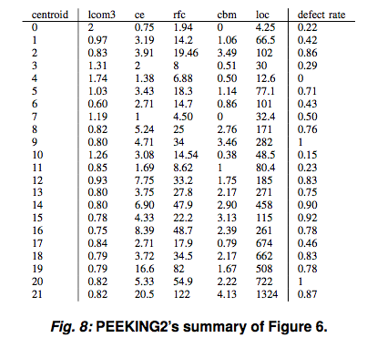

For many data sets:

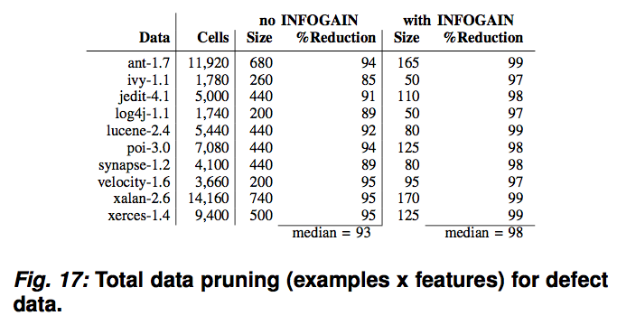

Note that for classification by weighted scores from 2 nearest neighbors,
the reduced data as accurate as the full data.

### Active Learning with Quick

Estimation data sets (a few dozen rows)

- Ekrem Kocaguneli, Tim Menzies, Jacky Keung, David Cok, and Ray Madachy. 2013. 
[Active Learning and Effort Estimation: Finding the Essential Content of Software Effort Estimation Data](../pdf/active.pdf)
IEEE Trans. Softw. Eng. 39, 8 (August 2013), 1040-1053. 

QUICK is an active learning method that assists in reducing the
complexity of data interpretation by identifying the essential
content of SEE datasets. QUICK works as follows:

1. Group rows and columns by their similarity;
2. Discard redundant columns (synonyms) that are too similar;
3. Sort rows by their outlier score (i.e. ones that are too distant);
4. Ask expert's opinion about sorted rows 1..x
5. Run CART on 1..x then check estimates on rows x+1...x+5.
6. Stop when accuracy no longer improves  

Details

- Input data matrix D (`D` may not have 
- Normalized all ranges min..max, 0..1
- Discard redundant columns (those that repeat information in other columns)
     - Transpose matrix (columns become rows);      
       `D1 = transpose(D)`
     - Compute RNN = reverse nearest neighbor score  between "rows"
       (count `popularity`; i.e. how often row X is someone else's nearest neighbor)
     - Reject the popular columns (contain repeated information)    
       `D2 = reject(D1)`
- Discard outlier rows (those taht are too wierd)
     - Transpose matrix (now columns are columns again);     
       `D3 = transpose(D2)`
     - Compute row popularity again
     - sort the rows by their popularity (most popular ones are most informative)    
       `D4 = sort(D3)`
- Ask in sorted order

Results: #1:  Need data on just a few projects

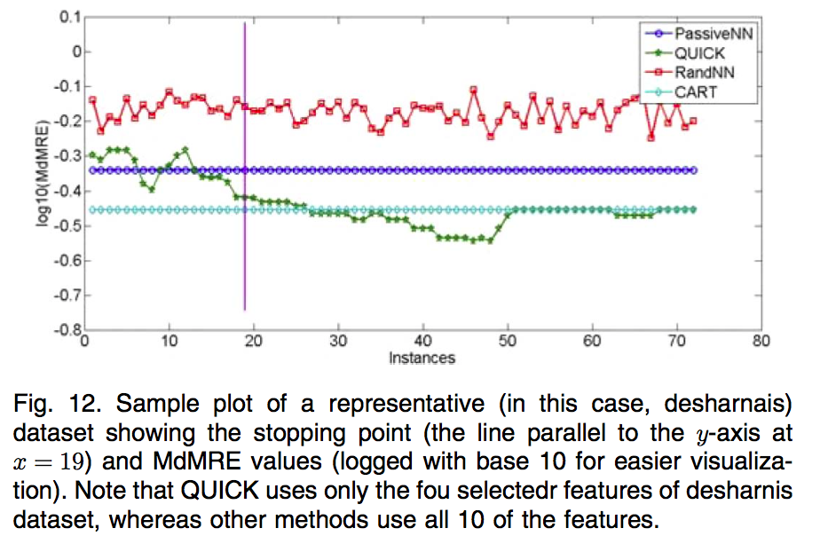

Results #2: uses very little of the data.

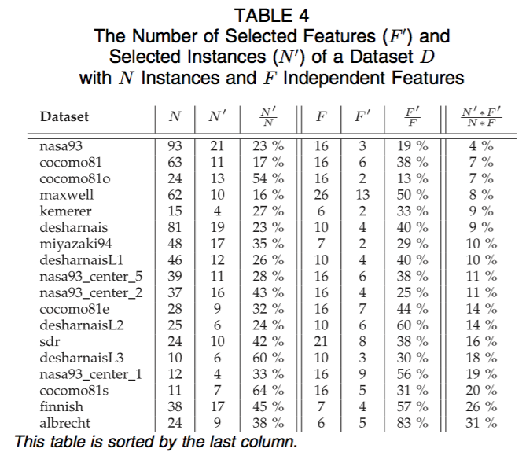

### Prototype Selection


