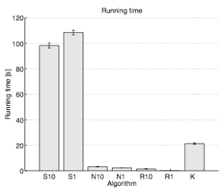

[home](http://tiny.cc/fss2016) | [copyright](https://github.com/txt/fss16/blob/master/LICENSE.md) &copy;2016, tim&commat;menzies.us 
    
[overview](https://github.com/txt/fss16/blob/master/doc/overview.md) |
[syllabus](https://github.com/txt/fss16/blob/master/doc/syllabus.md) |
[src](https://github.com/txt/fss16/blob/master/src) |
[submit](http://tiny.cc/fss2016give) |
[chat](https://fss16.slack.com/) 

_______

# Incremental Learning

How to turn a Naive Bayes classifier into an incremental learner:

+ Classify new examples BEFORE adding examples to training set

How to turn any learner into an incremental learning (premise: that
learner stabilizes on new examples faster than mode changes
in the underlying phenomena).

+ Note: never survived peer review. Sigh. [Incremental Discretization and Bayes Classifiers
            Handles Concept Drift and Scales Very Well](http://menzies.us/pdf/05sawtooth.pdf)
  
How to turn any recursive splitting algorithm into an incremental learner:

+ Supervise: build one classifier per leaf; keep a sample `S` of examples
        at each leaf; turn off learning once
        learner performance;    keep X% of the examples `B` that perform badly in that cluster;
        turn on learning for that leaf cluster starting with `S` + `B` 
+ Unsupervised: read `era` examples and cluster. For all subsequent eras,
        if new examples fall into old clusters then forgetaboutit. Else. sometimes,
        build new clusters. For more, see below.

## Simple single pass k-means

A sample incremental method

Farnstrom, F., Lewis, J., and Elkan, C. 2000. Scalability for clustering algorithms revisited. SIGKDD Explor. Newsl. 2, 1 (Jun. 2000), 51-57.  http://portal.acm.org/citation.cfm?id=360419

Model clusters as gaussians: i,e,  modeled by the  sum, sumSquared, and n of each feature.

+ When clusters combine, their new stats are the sum of the of the old sums, the sum of the old symSquareds, and the n
+ Do not add a point to a cluster if any of the its attributes falls outside of mean±1.96sd (for 95% confidence)

Algorithm:

1. Initialize k random clusters C1... Ck
2. Now we have old stats and new stats (initially, old stats is nil)
4. LOOP: Take 1% of the data and add it to a buffer.
4. For all remaining items in the buffer,  run k-means, moving the centroids (until they converge). If can add to a cluster (according to old confidence intervals), then add it (updating sum, sumSquared, and n of new stats).  Here, each cluster is treated as being a point at the mean values, weighted with the number of points in the that cluster.
5. When no more items can be added, then if any cluster has no items, seed it with the most distant data point
Now clear the buffer.
Add the new stats to the old stats.
6. If there is no more new data, stop. Otherwise, go to 3

Runs nearly twice as fast as old k-means.  Here's the results from using various clustering algorithms on the KDD 1998 cup data (95412 rows, 481 fields). This algorithm is "N1". Normal batch k-means is "K".  "R1" is a random sampling k-means (that, btw, generated low quality clusters).

Note that clusters generated by this algorithms, working in increments of 1% of the data,  produces clusters of almost the same quality as multiple-pass K-means.

Other advantages:
- Small enough memory that you could have multiple versions going, and pick the one with the lowest variances in the generated clusters.
-  Very simple implementation.
- Satisfies the **data mining desiderata**

The _Data mining Desiderata_ comes
from [Bradley et al.](https://www.aaai.org/Papers/KDD/1998/KDD98-002.pdf):

- Require one scan (or less) of the database if possible: a single data scan is considered costly, early termination if appropriate is highly desirable.
-  On-line “anytime” behavior: a “best” answer is always available, with status information on progress, expected remaining time, etc. provided
- Suspendable, stoppable, resumable; incremental  progress saved to resume a stopped job.
- Ability to incrementally incorporate additional data with existing models efficiently.
- Work within confines of a given limited RAM buffer.
- Utilize variety of possible scan modes: sequential,index, and sampling scans if available.
- Ability to operate on forward-only cursor over a view of the database. This is necessary since the database view may be a result of an expensive join query, over a potentially distributed data warehouse, with much processing required to construct each row (case).
