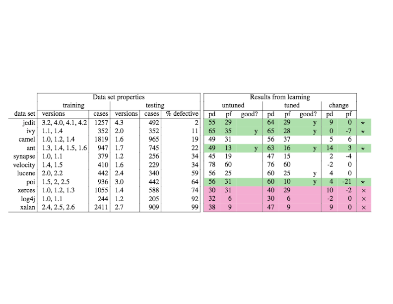
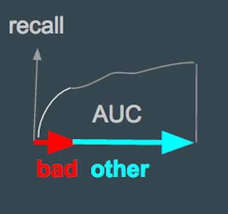
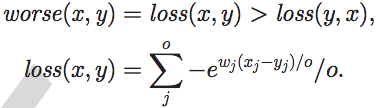
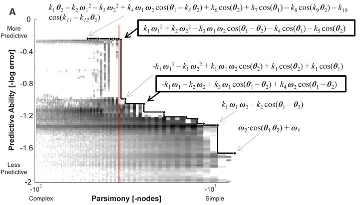

# Lecture2

In which we clarify and extend much of last week's discussion

## Data Science is (sometimes) not Science

- Data dabblers: show results that are not reproducible
    - No commitment to on-going community review and update of ideas
    - No commitment to verification and reverification and rereverification
         - Come on people, its called "re"search for a reason


## Software Science is Difference

Software scientists know much about software engineering

Software scientists exploit the inherent simplicity of software (See examples, below)

Software scientists may not produce general models:

- Constantly changing effects: new developers, new platforms, new tools, new tasks.
- Socio-technical factors that mean we cannot reason just about software but we also have to reason over the communities of people that design, build, use, and host those tools
- No underlying physical/chemical theory we can rely on for reasoning from first principles.  No background theory
(e.g. Black–Scholes or E=mc^2). Welcome to Simon's
[science of the artificial](http://courses.washington.edu/thesisd/documents/Kun_Herbert%20Simon_Sciences_of_the_Artificial.pdf): a constantly changing phenomena which we keep changing, every time we study it.

So the goal of software science may not be general models

- But cost effective ways for building and recognizing and maintaining best local models

Software scientists work with communities
     
- Results posted to web sites (intra-nets, internets) for communities to comment on
    - As programmers are extremely busy people, it is more useful to interpret the findings of machine learning/data mining output to them in a way they understand. 
    - Showing the raw output of a set of ML learners is not good enough.
- Results must be presented in their simplest, clearest form
    - So brevity and visualizations and intuitive explanations are  key
- Results are kept simple enough such that large communities can implement them
    - And givent he inherent simplicity of software, our solutions can be very simple indeed
    
Software scientists are software engineerings
    
- Are nervous about their models
    - So deliver them with extensive unit tests
    - Take great care to verify their conclusions
          - Across different subsets of the training data
          - Across different time stamps when the data was colelcted
- Enable refutability
    - By packaging and sharing the code for their experiments.
- Can build and maintain and improve software
    - They know the inner workings of these data miners
    - So they can improve them, refactor them, eliminate reducdacies, take advantage of
            the internal features
       
 
 ### Examples of Building Better Learners
 
 Wny understand the internals of a learner? Surely the off-the shelf tools are better?

Here is  35 likes of a Naive Bayes classifier that uses very little memory (each record is
read one a time, summarized into a few frequency counts, then discarded). Each conclusion
is augmented with a counter shown how much that conclusion is believed

- So this will scale to very large streams
- And this will alert us when we should not trust the conclusions


```awk
#naive bayes classifier in gawk
#usage: gawk -F, -f nbc.awk Pass=1 train.csv Pass=2 test.csv
#Golbals:
#    Total        : rows seen
#    H            : array of class names
#    Freq[h,x,y]  :  frequency with which x=y within rows about h
#    Attributes[i]: number of unique values within a column

Pass==1 {train()}
Pass==2 {what = classify(liked)
         print $NF "|" what, liked[what]c
}

function train( i,h) {
   Total++;
   h=$NF;  # the hypothesis is in the last column
   H[h]++; # remember how often we have seen "h"
   for(i=1;i<=NF;i++) {
      if ($i=="?")
        continue; # skip unknown values
      Freq[h,i,$i]++
      if (++_seen[i,$i]==1)
          Attributes[i]++} # remember unique values
}}

function classify( i,temp,what,like,h) {
   like = -100000; # smaller than any log
   for(h in H) { # for every hypothesis, do...
      temp=log(H[h]/Total); # logs stop numeric errors
      for(i=1;i<NF;i++) {
         if ( $i=="?" )
           continue; # skip unknwon values
        temp += log((Freq[h,i,$i]+1)/(H[h]+Attributes[NF])) }
     liked[h] = like
     if ( temp >= like ) { # we’ve found a better hypothesis
        like = temp
        what=h
   }}
   return what;
}
```

Is this better than a standard off-the-shelf Bayes classifier:

- No. It only handles non-numeric attributes (but adding numerics would add 5 more lines)...
- Yes. Most off-the-shelf data miners :
    - do not alert you when the confidence of the conclusion has fallen
    - assume all the data is loaded into RAM
    
### Examples of Simplicity (0)

Language model results (Naturalness, Devanbu).
      
- Given N prior symbols, can predict the N+1 symbol
- Note: if next symbol NOT what you predicted then
     - this code is doing something unusual
     - this code can be predicted to  be buggy
     - [Devanbu](http://macbeth.cs.ucdavis.edu/odd-bugs.pdf)

### Examples of Simplicity (1)

 e.g. text mining defect reports
     - reports have `W` words in `D` documents (defect reports)
     - W is large (10,000, 100,000), too big for most data miners
     - a word appears `w` times in `d` documents, then term-frequency inverse document frequency is
         - `tfidf(w,d) = w/W * log(D/d)`
     - which rewards words that appear a lot, but only in a  few documents
 
 If that sounds complex, it ain't
 
```awk
# file: tdidf.awk
function train() {
  Documents++;
  for(I=1;I<NF;I++) {
    if( ++In[$I,Documents]==1)
      Document[$I]++
    Word[$I]++
    Words++ }
}

function tfidf(i) {
  return Word[i]/Words*log(Documents/Document[i])
}
```

Which can be called like this to find the top 100 words (as scored by Td*Idf

```sh
cat $1 |
gawk -f tfidf.awk --source ’
        { train() }
    END { OFS=","
          for(I in Word) 
              print I, tfidf(I) } ’  |
sort -t, -n +0 | 
tail -100
```

Note that most words have a very, very low TfIdf.


So text mining can sometimes be very easy

- Apply any data miner to just the top, say, 100  TF*IDF words
- From [NASA data, input defect text to output a prediction of defect severity:
    - f = 71,71, 71,80,82,87,92,92,98

### Examples of Simplicity (2)

Consider this data: https://github.com/abutcher/toe/blob/master/lisp/data/arff/bn.arff

E.g. linear regression on bn.arff yielded:

```
Defects =     
    82.2602 * S1=L,M,VH +
    158.6082 * S1=M,VH +
    249.407  * S1=VH +
     41.0281 * S2=L,H +
     68.9153 * S2=H +
    151.9207 * S3=M,H +
    125.4786 * S3=H +
    257.8698 * S4=H,M,VL +
    108.1679 * S4=VL +
    134.9064 * S5=L,M +
   -385.7142 * S6=H,M,VH +
    115.5933 * S6=VH +
   -178.9595 * S7=H,L,M,VL +
   ...
   [ 50 lines deleted ]

```
On a 10-way cross-validation, this correlates 0.45 from predicted to actuals.
10 times, take 90% of the date and run a WRAPPER- a best first search through combinations of attributes. At each step, linear regression was called to asses a particular combination of attributes. In those ten experiments, WRAPPER found that adding feature X to features A,B,C,... improved correlation the following number of times:

```
number of folds (%)  attribute
           2( 20 %)     1 S1
           0(  0 %)     2 S2
           2( 20 %)     3 S3
           1( 10 %)     4 S4
           0(  0 %)     5 S5
           1( 10 %)     6 S6
           6( 60 %)     7 S7     <==
           1( 10 %)     8 F1
           1( 10 %)     9 F2
           2( 20 %)    10 F3
           2( 20 %)    11 D1
           0(  0 %)    12 D2
           5( 50 %)    13 D3     <==
           0(  0 %)    14 D4
           0(  0 %)    15 T1
           1( 10 %)    16 T2
           1( 10 %)    17 T3
           1( 10 %)    18 T4
           0(  0 %)    19 P1
           1( 10 %)    20 P2
           0(  0 %)    21 P3
           1( 10 %)    22 P4
           6( 60 %)    23 P5     <==
           1( 10 %)    24 P6
           2( 20 %)    25 P7
           1( 10 %)    26 P8
           0(  0 %)    27 P9
           2( 20 %)    28 Hours
           8( 80 %)    29 KLoC   <==
           4( 40 %)    30 Language
           3( 30 %)    32 log(hours)
```

Four variables appeared in the majority of folds. A second run did a 10-way using just those variables to yield a smaller model with (much) larger correlation (98\%):

```
Defects =
    876.3379 * S7=VL +
   -292.9474 * D3=L,M +
    483.6206 * P5=M +
      5.5113 * KLoC +
     95.4278
```     

    
## Evaluation

### Classifiers (target = one column of symbols called ``classes'')

```
                     truth
                   .----.-----.
                   | no | yes |
                   .----.-----.
detector   silent  | A  |  B
           loud    | C  |  D
```         

Raw

- True negative = A
- False negagive= B
- False positive= C
- True positive = D
- Effort        = amount of code selected by detector
        - (c.LOC + d.LOC)/(Total LOC)

Derived

- recall = pd = `D/(B+D)`
- accuracy    = `(A+D)/(A+B+C +D)`
- precision   = `D/(C+D)`
- false alarm=pf= `C/(A+C)`
- pos/neg = `(B+D)/(A+C)`


Turns out, precision and accuracy aren't very precision or accurate
when the target class is very small (effort> 10).

-  Issue of missed balanced data
-  Standard trick: during cross-val, [SMOTE](https://www.jair.org/media/953/live-953-2037-jair.pdf) the training set
       - take the minority class with `E` examples
       - randomly throw away majority classes till you get to `3*E` examples
       - randomly build new minority examples by (a) find the five nearest neighbors
         of the same minority class X, (b) pick P, one of those five at random; (c) create a new
         minority class member at a random point between X and P; (d) repeat till you get `3*E` examples
       - Beginner trap: you can SMOTE to training set but not the test set.
      



PD and effort are linked. The more modules that trigger
       the detector, the higher the PD. However, effort also gets
        increases.
        
        
High PD or low PF comes at the cost of high PF or low PD
        (respectively). This linkage can be seen in a standard
        receiver operator curve (ROC).  Suppose, for example, LOC> x
        is used as the detector (i.e. we assume large modules have
        more errors). LOC > x represents a family of detectors. At
        x=0, EVERY module is predicted to have errors. This detector
        has a high PD but also a high false alarm rate. At x=0, NO
        module is predicted to have errors. This detector has a low
        false alarm rate but won't detect anything at all. At 0<x<1,
        a set of detectors are generated as shown below:


                 pd
               1 |           x  x  x                KEY:
                 |        x     .                   "."  denotes the line PD=PF
                 |     x      .                     "x"  denotes the roc curve 
                 |   x      .                            for a set of detectors
                 |  x     .
                 | x    . 
                 | x  .
                 |x .
                 |x
                 x------------------ pf    
                0                   1

Note that:

- The only way to make no mistakes (PF=0) is to do nothing
        (PD=0)
- The only way to catch more detects is to make more
         mistakes (increasing PD means increasing PF).
- Our detector bends towards the "sweet spot" of
         <PD=1,PF=0> but does not reach it.
- The line pf=pd on the above graph represents the "no information"
         line. If pf=pd then the detector is pretty useless. The better
         the detector, the more it rises above PF=PD towards the "sweet spot".

### Problems with precision

All the above are linked as follows

- Recall prec = `D/(D+C)`
- Divide top and bottom by `D` to get `1/(1+C/D)`
- This can be exanded to `1 / (1+ neg/pos * pf/recall)`
- Re-arranging `pf = pos/neg * (1-prec)/prec *recall`

So these variables are all connected via properties of the data set. For more on this,
see 

- Problems with Precision, 2007, http://menzies.us/07precision.pdf
- [abcd.py](../src/abcd.py)


### Numerics Goals

When the goal is numeric

Results for one example

- E= expected
- A= actual
- Residual = E-A

results fro many examples

- AR = magnitude residual = abs(E-A)
- MdAR = median magnitude residual
- Pred(N) = percent of examples where AR < N%
      - e.g. Pred(30)
- SA = `1 - (MdAR/ baseline)` where the baseline is the the MdAR after doing the simplest
  possible estimation; e.g. set expected to the median value of all the perfromance scores

### Multiple Numeric Goals

Some aggregation function that turns N nums into 1:

- e.g. f-measure = `(2 * pd * prec) / (pd + prec)`
      - has the property that if either are low, the product is low as well.
- e.g. g-measure = `(2 * pd * (1-pf))/ (pd + 1 - pf)`
      - Use if you are worried about precision

Area-under the curve

- useful for combining two variables
    - e.g AUC(prec,recall)

- Common on software analytics
      - find most code after reading least code
      - `Bad` = modules predicted defective
      - `Other` = all other modules
      - Sort each increasing by LOC
      - Track the recall



Multi-objective-domination

- Given examples X,Y,Z,.... with N goals
     - each goal N has a direction for `better` (more, less)
     - e.g. cost is usually better if less; i.e. minimize
- `X` "dominates" `Y` if
     - binary domination: better on at least on goal and worse on none
            - returns true, false
            - if many goals, then often false (so bad for 3+ goals)
     - continuous domination: sum of different in each goal, raised to an exponential
            - so small differences SHOUT louder
            - X dominates Y if the the "losses" X to y are less than the "losses" y to X
            - better for large numbers of goals

```python
def bdom(x, y, abouts):
  x       = abouts.objs(x)
  y       = abouts.objs(y)
  betters = 0
  for obj in abouts._objs:
    x1, y1 = x[obj.pos], y[obj.pos]
    if   obj.better(x1,y1) : 
       betters += 1
    elif x1 != y1: 
       return False # must be worse, go quit
  return betters > 0
```

Continuous domination:



```python
def cdom(x, y, abouts):
  "many objective"
  x= abouts.objs(x)
  y= abouts.objs(y)
  def w(better):
    return -1 if better == less else 1
  def expLoss(w,x1,y1,n):
    return -1*math.e**( w*(x1 - y1) / n )
  def loss(x, y):
    losses= []
    n = min(len(x),len(y))
    for obj in abouts._objs:
      x1, y1  = x[obj.pos]  , y[obj.pos]
      x1, y1  = obj.norm(x1), obj.norm(y1)
      losses += [expLoss( w(obj.want),x1,y1,n)]
    return sum(losses) / n
  l1= loss(x,y)
  l2= loss(y,x)
  return l1 < l2 
 ``` 

     
Space of all non-dominated solutions = Pareto frontier

     


- `M` optimizers each explore a population of size `S` 
  while struggling to find good solutions 
      - this create `Pm` multiple frontiers
- The _reference frontier_ `R` is:
       - `Q = removeDups( union(Pm))`
       - `R = reduced( nondiminated(Q) )` where nondominated was defined above and
         `reduced` is some sorting function that selects no more than `S` items
                - By convention, nondominated is with `bdom`
- The value of `M` is how close `Pm` is to `R`
       - `IGD` = inter-generational distance = for all items in `Pm`, what is the
         closest item in `R`
       - `M1` is better than `M2` if its IGDs are _smaller_.

### Cross-Validation

Don't assess using the training data.


Why?
- http://www.astroml.org/sklearn_tutorial/practical.html


Details:
- http://blog.fliptop.com/blog/2015/03/02/bias-variance-and-overfitting-machine-learning-overview/


If our algorithm shows high bias, the following actions might help:

- Add more features. In our example of predicting home prices, it may be helpful to make use of information such as the neighborhood the house is in, the year the house was built, the size of the lot, etc. Adding these features to the training and test sets can improve a high-bias estimator
= Use a more sophisticated model. Adding complexity to the model can help improve on bias. For a polynomial fit, this can be accomplished by increasing the degree d. Each learning technique has its own methods of adding complexity.
- Use fewer samples. Though this will not improve the classification, a high-bias algorithm can attain nearly the same error with a smaller training sample. For algorithms which are computationally expensive, reducing the training sample size can lead to very large improvements in speed.
- Decrease regularization. Regularization is a technique used to impose simplicity in some machine learning models, by adding a penalty term that depends on the characteristics of the parameters. If a model has high bias, decreasing the effect of regularization can lead to better results.

- If our algorithm shows high variance, the following actions might help:

- Use fewer features. Using a feature selection technique may be useful, and decrease the over-fitting of the estimator.
- Use more training samples. Adding training samples can reduce the effect of over-fitting, and lead to improvements in a high variance estimator.
- Increase Regularization. Regularization is designed to prevent over-fitting. In a high-variance model, increasing regularization can lead to better results.
- These choices become very important in real-world situations. For example, due to limited telescope time, astronomers must seek a balance between observing a large number of objects, and observing a large number of features for each object. Determining which is more important for a particular learning task can inform the observing strategy that the astronomer employs. In a later exercise, we will explore the use of learning curves for the photometric redshift problem.

