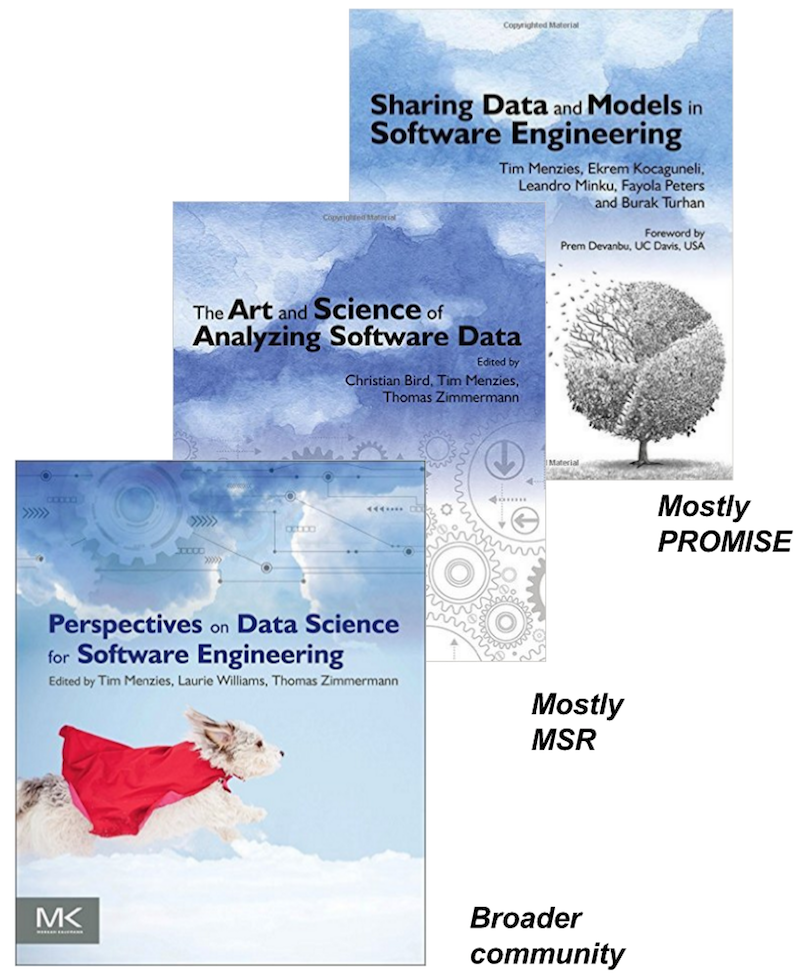

[home](http://tiny.cc/fss2016) | [copyright](https://github.com/txt/fss16/blob/master/LICENSE.md) &copy;2016, tim&commat;menzies.us 
    
[overview](https://github.com/txt/fss16/blob/master/doc/overview.md) |
[syllabus](https://github.com/txt/fss16/blob/master/doc/syllabus.md) |
[submit](http://tiny.cc/fss2016give) |
[chat](https://fss16.slack.com/) 

_______

#  Lecture 1: What is The Science of Software?

Most software companies now learn their policies via
data-driven methods. Modern practitioners treat
every planned feature as an experiment, of which
only a few are expected to survive. Key performance
metrics are carefully monitored and analyzed to
judge the progress of a feature. Even simple design
decisions such as the color of a link are chosen by
the outcome of software experiments.

This subject will explore methods for designing data
collection experiments; collecting that data;
exploring that data; then presenting that data in
such a way to support business-level decision making
for software projects.

## But what is Science?

_Science_ is about making and maintaining and monitoring our best current guesses about X,Y,Z...

- "All models are wrong, but some are useful." -- George Box

Sure, data supports many models, many "truths".

- But there are lot more "wrongs" that are not supported in any data set
- Science is the grease beneath the wheels of insight
      - Science is the tool that drives us to being probably more right-er than wrong-er  
- And the most important moment in science is not "Eureka!" but "huh, that's odd".

FYI: most "scientific" papers are a post-hoc rationalization of an essentially random process.

- "Random" as in "biased towards a goal". 
- You just keep throwing stuff at a wall
- And, if you are dedicated enough and disciplined enough then
      - some of it will stick; and
      - you'll know enough about your field to know (a) why that is interesting and (b) how
      to report that such that your peers will be interested.

For a fine read, try [Arthur Koestler's  Sleepwalkers](https://www.amazon.com/Sleepwalkers-History-Changing-Universe-Compass/dp/0140192468/ref=sr_1_cc_1?s=aps&ie=UTF8&qid=1471281223&sr=1-1-catcorr&keywords=Arthur+Koestler%27s+-+The+Sleepwalkers):
- What if our greatest scientific discoveries had been stumbled upon by chance? In The SleepwalkersArthur Koestler recounts the history of cosmology - from the Babylonians through to Newton - exploring how genius and progress flourished unexpectedly in the space between science and humanity, faith and reason
-  "Some of the greatest discoveries...consist mainly in the clearing away of psychological roadblocks which obstruct the approach to reality; which is why,post factum they appear so obvious."  -- Arthur Koestler

Science never stops.

- "A conclusion is simply the place where you got tired of thinking."-- Dan Chaon
- "Give me the fruitful error any time, full of seeds, bursting with its own corrections.
  You can keep your sterile truth for yourself." -- Vilfredo Pareto

(BTW, for a formal model of science, see _Karl Popper, Conjectures and Refutations Routledge and Keagan Paul, 1963._)

## And what is Data Science?

Science has escaped the lab, and now roams free.

- Anyone can be a scientist (make generalizations from data) just by downloading and running freely available data miners.
- Such data science now mediates what we see and how we act
     - Silicon valley developers view every new feature as  an experiment, to be tested within some mash up.
     - Chemists win  Nobel Prize for  software sims. http://goo.gl/Lwensc 
     - Engineers use software to optical tweezers, radiation therapy, remote sensing,  chip design,   http://goo.gl/qBMyIZ  
     - Web analysts use software  to analyze clickstreams to improve sales and marketing strategies http://goo.gl/b26CfY
     - Stock traders write software to simulate trading strategies. http://www.quantopian.com
     - Analysts write software  to mine   labor statistics data to review proposed gov policies. http://goo.gl/X4kgnc  
     - Journalists use software   to analyze economic data, make visualizations of their news stories.
       http://fivethirtyeight.com 
     - In London or New York,  ambulances wait for your call at a location determined by a software model.
       http://goo.gl/8SMd1p

Maybe old wine in new bottles?

Sadly, data science is not always about _science_:

- Science is about communities discussing and improving refutable conclusions.
- But, sadly, some data science is just about vendors selling you their latest whiz bang tool/service
       - How to check?
       - Are communities constantly checking old beliefs and updating their ideas w.r.t. new ones?
       - Are conclusions replayable (so not 1000 clicks in a pretty GUI but a script that can re-run)

## So what is Software Science?

Sometimes data science is about _software science_:

Software science is about software engineering projects

- So a software scientist needs to know much about software engineering
- Hence, nearly a quarter of the marks in this subject are from reading assignments

Software science is about an set of experimental standards accepted by this community:

- Which we will teach by example in this class

Software scientists explain
their results to software engineerings-- who are very busy, very smart, very
opinionated people. Hence, software
scientists need to be very concerned about the comprehensibility of the learned models.

- Hence, much of this subject will be focused on intuitive explanations, visualizations, minimizations
  of the output of data miners.

IMHO, Software science cannot be about general models of SE

- But cost effective ways of finding local models?
- Why?
      - Constantly changing effects: new developers, new platforms, new tools, new tasks.
      - Socio-technical factors that mean we cannot reason just about software but we also have to reason over the communities of people that design, build, use, and host those tools
      - No underlying physical/chemical theory we can rely on for reasoning from first principles.  No background theory
(e.g. Black–Scholes or E=mc^2). Welcome to Simon's
[science of the artificial](http://courses.washington.edu/thesisd/documents/Kun_Herbert%20Simon_Sciences_of_the_Artificial.pdf): a constantly changing phenomena which we keep changing, every time we study it.

Software science is about refutable conclusions

- So all our code will be sharable, in Github
- Our projects will include reproduction packages that allow people to take our code and repeat
        the analysis
       
Software engineering has some remarkable _natural_ properties:

- <em>Programming languages, in theory, are complex, flexible
and powerful, but the programs that real people
actually write are mostly simple and rather repetitive,
and thus they have usefully predictable statistical properties
that can be captured in statistical language models
and leveraged for software engineering tasks.</em>   -- Devanbu et al. [naturalness of software](http://macbeth.cs.ucdavis.edu/natural.pdf)

This leads to some remarkably simple results that are most useful

- [Watch James Larus video](https://www.youtube.com/watch?v=kO9OYnkeRTM)
- [Read Matt Martin's poster](http://tiny.cc/iposter) point).
- e.g. the strange tale of NASA's [text-based severity defect prediction](http://menzies.us/pdf/07anomalies-pits.pdf)
- e.g. give me 3 variables and [I can predict project effort](http://menzies.us/pdf/05chen.pdf)

_Software science_ also studies its own software:

- As software engineers, we are the people who are most suspicious of our software(hell, we wrote it,
and we know how dumb we can be)
      - regression suites, on-line comment forums, code that others can fork improve and (maybe) be merged back within our own code.
- Otherwise, people can get hurt
     - Space shuttle Columbia ice strike (size= 1200 cm3; speed: 477 mpg)
     - Certified as “safe” by CRATER: a micro-meteorite software model
     - Typical  CRATER training example: (size=3 cm2; speed= 100 mpg)
     - Lesson: conclusions should come with “certification envelope” (aise alert when new problems fall outside of old envelope)

- While other communities might be content to use data science software tools, built by others, software scientists know how
to maintain and extend and deply rapdily changing software. Hence while  AI researchers might be the source of 
better data miners algorithms, it is software  scientists who package and wrap those algorithms
in environments that support usability, reproducibility, maintainability and scalability.

Finally, software engineers are engineers and hence are duty bound to follow
ethical practices in their work.

- Appropriate ethics for data science is still an
evolving area-- which means that software scientists have to be more alert to
  ethical issues that  other kinds of data scientists 

## Resources

Can you pick the bias in the following story?

### Data sets

So many places. Too many to list. One place to start:

### Papers

2011: [The Inductive Engineering Manifesto](https://www.microsoft.com/en-us/research/wp-content/uploads/2016/02/menzies2011ise.pdf)

- Users before algorithms
- Plan for scale
- Early feedback
- Be open-minded
- Do smart learning
- Live with the data you have
- Broad skill set, big toolkit

2013: Software Analytics, So What?

- [Menzies and Zimmermann, 2013](http://ieeexplore.ieee.org/stamp/stamp.jsp?reload=true&arnumber=6547619)
-  Argues that before we ask "what tool to use?" we ask "what questions are useful to  ask, a lot"
- Initially, we have to ask many many questions before we find the most useful ones
- Finally, we can code tools to make those "most useful questions" easy to be asked.

###  Recent books on software analytics (optional, no need to buy)

- 2014: Me and my friends:  [Sharing Data and Models](https://www.amazon.com/Sharing-Data-Models-Software-Engineering/dp/0124172954). Come geek out with timm!
- 2015: Details, from the mining software repositories community: [The Art and Science of Analzyzing
Software Data](https://www.amazon.com/Art-Science-Analyzing-Software-Data/dp/0124115195/ref=pd_sim_14_1?ie=UTF8&dpID=51oNmb8bLJL&dpSrc=sims&preST=_AC_UL160_SR130%2C160_&psc=1&refRID=MG3VE0637M484XBQ7Z9Q) : 100s of top names in SE including several from NC State CSC
- 2016: For a broader view: lists dozens of small ``mantras'' of software science:
[Perspectives on Data Science](https://www.amazon.com/Perspectives-Data-Science-Software-Engineering/dp/0128042060/ref=sr_1_1?s=books&ie=UTF8&qid=1471278031&sr=1-1&keywords=perspectives+on+data+science)

  

